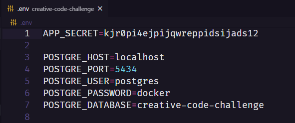
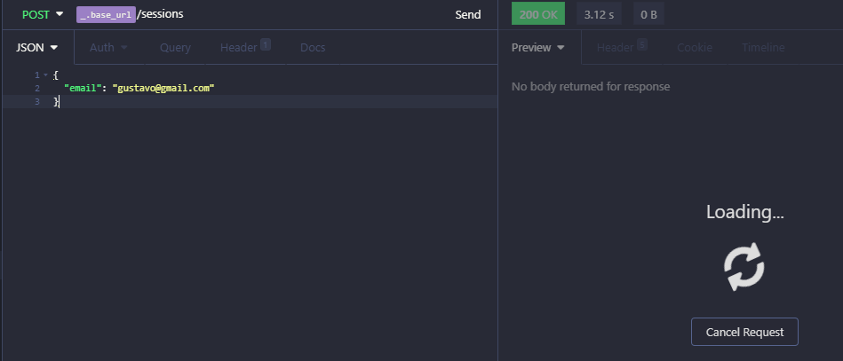
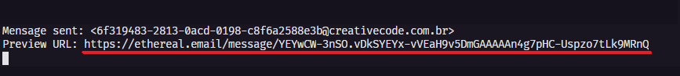
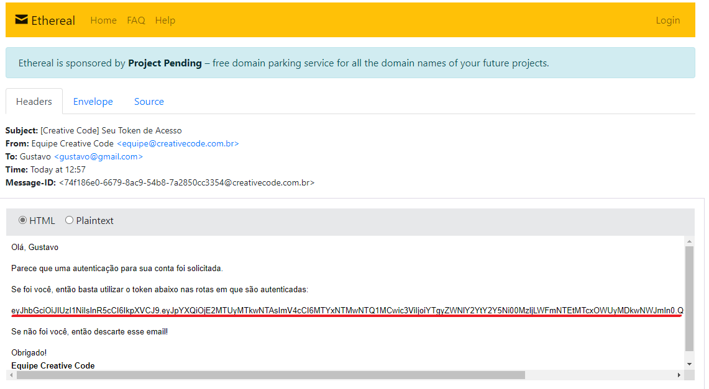
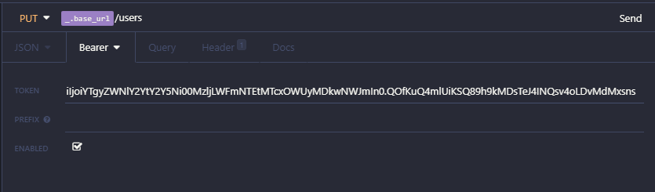

# Desafio Creative Code back-end

  - [O Desafio](#o-desafio)
  - [Tecnologias Utilizadas](#tecnologias-utilizadas)
  - [Clonando o Projeto](#clonando-o-projeto)
  - [Configurando o Banco](#configurando-o-banco)
  - [Gerando Migrations](#gerando-migrations)
  - [Iniciando o Projeto](#iniciando-o-projeto)
  - [Rotas da API](#rotas-da-api)
  - [Executando testes](#executando-testes)
  
  
 <p align="center">
  

  


  
  
  <a href="https://github.com/gnf22/dsdeliver-sds2/commits/master">
    
  </a>

  <a href="https://github.com/gnf22/dsdeliver-sds2/commits/master">
    
  </a>

  
</p>

### O Desafio

O desafio consiste em desenvolver uma API rest que permita o CRUD de Usuários e Endereços.

## Tecnologias Utilizadas

Este projeto utiliza as seguintes tecnologias:

-  [NodeJS](https://github.com/nodejs/node)
-  [Express](https://github.com/expressjs/express)
-  [TypeORM](https://github.com/typeorm/typeorm)
-  [SwaggerUI](https://github.com/swagger-api/swagger-ui)
-  [Jest](https://github.com/facebook/jest)
-  [Tsyringe](https://github.com/microsoft/tsyringe)
-  [Typescript](https://github.com/microsoft/TypeScript)
-  [Eslint](https://github.com/eslint/eslint)
-  [Prettier](https://github.com/prettier/prettier)


     
### Clonando o Projeto

Requisitos:
  - Git
  - Node.JS
  - npm ou yarn

1. Clone este repositório
```bash
git clone https://github.com/gnf22/creative-code-challenge.git
```

2. Escolha a pasta gerada do projeto
```bash
cd creative-code-challenge
```

3. Instale as dependências

&nbsp;
Com o yarn:
```bash
yarn
```

Ou com o npm
```bash
npm install
```

### Configurando o Banco
1. Na pasta raíz do projeto, você deve criar um arquivo .env com as seguintes variáveis como no exemplo abaixo, realizando a configuração de acordo com suas credenciais. (Necessário ser um banco postgres)


     
### Gerando Migrations
1. Após realizar as configurações acima, você deve agora rodar o comando para gerar as tabelas do banco.

&nbsp;
Com o yarn:
```bash
yarn typeorm migration:run
```

Ou com o npm
```bash
npm run typeorm migration:run
```

### Iniciando o Projeto
1. Após todo esse passo a passo, agora você pode executar o projeto.

&nbsp;
Com o yarn:
```bash
yarn dev:server
```

Ou com o npm
```bash
npm run dev:server
```

2. O projeto estará rodando em `http://localhost:3333`

&nbsp;
Exemplo: `localhost:333/users`


### Rotas da API
## User


#### 1. Adicionar novo Usuário:  **POST** `http://localhost:3333/users` 
Corpo da requisição:
```json
{
	"name": "Gustavo",
	"telephone": "1194529284",
	"email": "gustavo@gmail.com",
	"age": 20,
	"weight": 1.70,
	"ethnicity": "branco"
}
```

Cadastro com sucesso: **STATUS: 200 OK**
```json
{
  "id": "b4fbf0d8-e529-46e0-9024-f7da82126403",
  "ethnicity": "branco",
  "name": "Gustavo",
  "telephone": "1194529284",
  "email": "gustavo@gmail.com",
  "age": 20,
  "weight": 1.7,
  "created_at": "2021-03-08T15:52:58.484Z",
  "updated_at": "2021-03-08T15:52:58.484Z"
}
```

E-mail já utilizado: **STATUS: 409 CONFLICT**
```json
{
  "status": "error",
  "message": "E-mail already in use. Choose another"
  }
```

#### 2. Autenticação:  **POST** `http://localhost:3333/sessions` 
```json
{
	"email": "gustavo@gmail.com",
}
```

Autenticação com sucesso: **STATUS: 200 OK**
```
No body returned for response
```

Autenticação com usuário inexistente: **STATUS: 404 NOT FOUND**
```json
{
  "status": "error",
  "message": "User does not exist."
}
```

Para utilizar todas as rotas abaixo (Inclusive as de Address) é necessário ter realizado a autenticação acima de autenticação. Segue um tutorial de como utilizar:
1. Realize a requisição de autenticação: **POST** `http://localhost:3333/sessions



2. No seu console, acesse o link gerado (Sublinhado em vermelho)


     
3. Copie o token gerado (Sublinhado em vermelho)


     
4. Na requisição desejada, escolha a opção Bearer e cole o token gerado no e-mail


     
Erros possíveis ao tentar utilizar rotas autenticadas:


Autenticação sem o token: **STATUS: 401 UNAUTHORIZED**
```json
{
  "status": "error",
  "message": "JWT token is missing"
}
```

Autenticação com token inválido ou que já venceu (Prazo de 24 horas): **STATUS: 401 UNAUTHORIZED**
```json
{
  "status": "error",
  "message": "Invalid JWT token"
}
```

#### 3. Alteração:  **PUT** `http://localhost:3333/users` 
```json
{
	"name": "Guilherme",
	"telephone": "647674",
	"email": "gui@gmail.com",
	"age": 12,
	"weight": 1.70,
	"ethnicity": "branco"
}
```

Alterado com sucesso: **STATUS: 200 OK**
```json
{
  "id": "a82ececf-cf96-439c-af51-1719e20905bf",
  "ethnicity": "branco",
  "name": "Guilherme",
  "telephone": "647674",
  "email": "gui@gmail.com",
  "age": 12,
  "weight": 1.7,
  "created_at": "2021-03-08T17:09:12.423Z",
  "updated_at": "2021-03-08T19:17:53.744Z"
}
```

Alterar usuário que não existe: **STATUS: 404 NOT FOUND**
```json
{
  "status": "error",
  "message": "User does not exist"
}
```

Alterar usuário com e-mail em uso: **STATUS: 409 CONFLICT**
```json
{
  "status": "error",
  "message": "User does not exist"
}
```

#### 4. Consulta:  **GET** `http://localhost:3333/users`

Consulta com sucesso: **STATUS: 200 OK**
```json
[
  {
    "id": "6b029086-3dcc-40fe-8701-f9f9ba1727ba",
    "ethnicity": "branco",
    "name": "Gustavo",
    "telephone": "11930087625",
    "email": "gust@gmail.com",
    "age": 10,
    "weight": "1.40",
    "created_at": "2021-03-08T00:48:05.065Z",
    "updated_at": "2021-03-08T00:48:05.065Z"
  },
  {
    "id": "76045c24-2979-4831-b786-44209595c8b8",
    "ethnicity": "branco",
    "name": "Guilherme",
    "telephone": "11930087625",
    "email": "gui@gmail.com",
    "age": 10,
    "weight": "1.40",
    "created_at": "2021-03-08T08:16:38.572Z",
    "updated_at": "2021-03-08T08:16:38.572Z"
  },
  {
    "id": "a82ececf-cf96-439c-af51-1719e20905bf",
    "ethnicity": "branco",
    "name": "Carlos",
    "telephone": "647674",
    "email": "carlos@gmail.com",
    "age": 12,
    "weight": "1.70",
    "created_at": "2021-03-08T17:09:12.423Z",
    "updated_at": "2021-03-08T19:19:43.976Z"
  }
]
```

Consulta com usuário que não existe: **STATUS: 404 NOT FOUND**
```json
{
  "status": "error",
  "message": "You are not authenticated."
}
```

#### 3. Exclusão:  **DELETE** `http://localhost:3333/users`

Exclusão com sucesso: **STATUS: 200 OK**
```
No body returned for response
```

#### 5. Exclusão com usuário que não existe: **STATUS: 404 NOT FOUND**

```json
{
  "status": "error",
  "message": "User does not exist."
}
```

## Executando testes
1. Para executar os testes no projeto, siga os seguintes passos:
```bash
# Execute o script de testes
yarn test
```

2. Você pode visualizar uma interface amigável com os resultados dos testes acessando coverage/lcov-report/index.html
